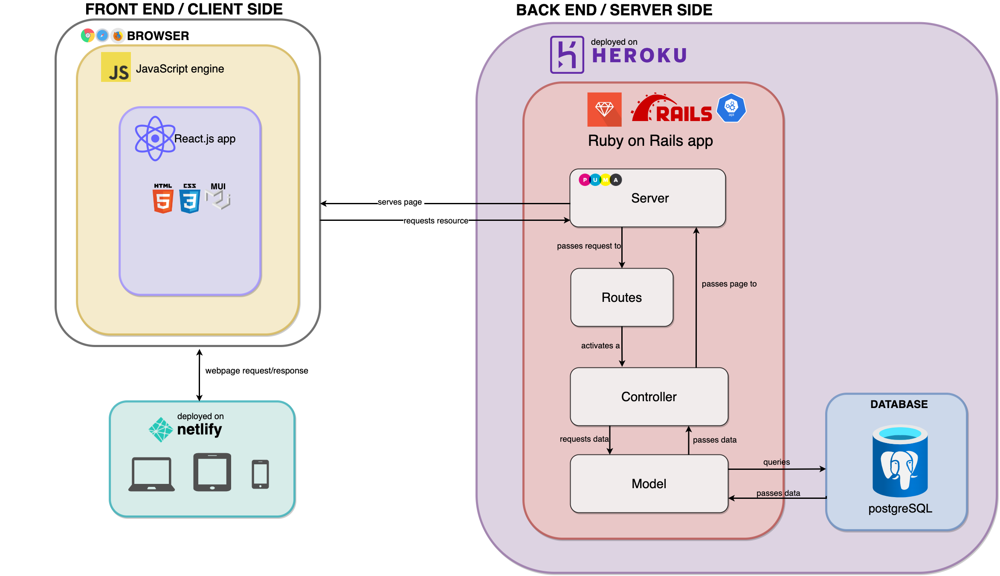
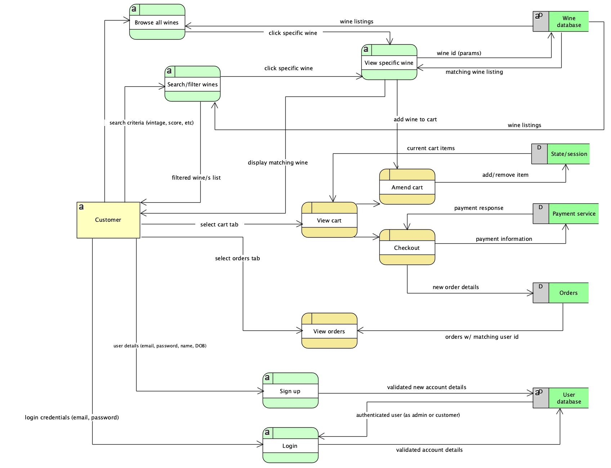
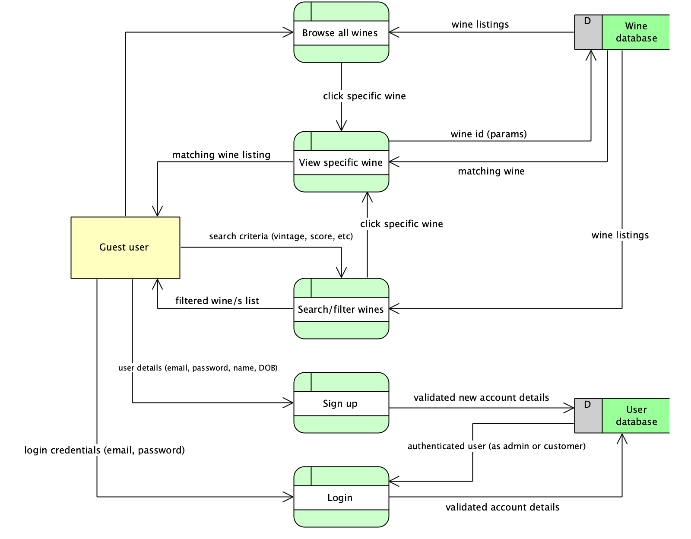
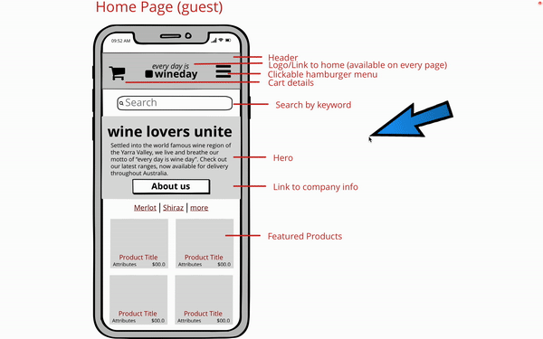

# Web App: WineDay (frontend)

This repo contains the front-end for a fictional wine e-commerce store built for a fictional business: WineDay. It was developed with React and deployed on Netlify.

The other relavant repos can be found here:

- [Backend](https://github.com/angieloux/wineday-back-end) (created with Ruby on Rails, hosted on heroku)
- [Planning documentation](https://github.com/angieloux/wineday-docs) (which can also be found at the bottom of this document, for reference).

# Links

- [Deployed website](https://wineday.netlify.app/)
- [Trello board](https://trello.com/b/7TaAyqk8/t3a2)
- [This front-end repo](https://github.com/angieloux/wineday-front-end)
- [The back-end repo](https://github.com/angieloux/wineday-back-end)
- [Original planning repository](https://github.com/angieloux/wineday-docs)
- [User testing workbook](https://docs.google.com/spreadsheets/d/e/2PACX-1vTbDicEG5nChHB6cVBtfCqUXtTXXtG7mIQkaQ5SaVdKJujoLzqwBdMsFHrW3Xwj4msacdTLbfFt1of1/pubhtml) containing multiple stages of user testing, including 3 development stages and 2 production stages.
-

# Local installation

If you would like to install a local copy of this web app, you will also need to locally host the Ruby on Rails back end server (instructions can be found in the [back-end repo](https://github.com/angieloux/wineday-back-end)).

Clone the repo:

    git clone git@github.com:angieloux/wineday-front-end.git

Navigate to the correct directory you just cloned:

    cd wineday-front-end

Using your preferred package manager, install dependencies.

With yarn:

    yarn install

With NPM:

    npm install

To run it locally in development mode:

    yarn start

# Testing

Unit tests have been included for various helper functions within the app. You can see these in action with your preferred package manager.

With yarn:

    yarn test

With NPM:

    npm test

# Updated project details

Due to time constraints the web app has deviated slightly from the original planning documentation as set out in the docs repo. Whilst most features are implemented and are all functional, the scope of the app will be significantly expanded in future versions. These changes are listed below:

### Searching/filtering

Currently a user can search for any keyword ('cherry' or 'red', etc) and it will locate the corresponding wines within the database. They can also search by the top nav, which has two dropdowns: By variety and By region. In future version of the app, a high-scoring filter will be added, and those wines will be featured on the landing page.

### User management

As mentioned in the original planning phase, an admin role was never considered to be a part of the MVP. Thus, it was not focused on in this version of the app.

### Checkout process

The checkout process right now is a mockup of what is to come, as Stripe will be implemented as the payments platform. This will also incorporate a formal Order Confirmation page once an order has been placed.

### Stylistic differences

The original wireframes show features like breadcrumbs & toasts (for when a customer adds something to the cart). As mentioned in the original planning, an About Page was also not part of the MVP. These sprinkle features will ideally come next.

# Dependencies

- **React version:** 18.2.0

##### Key React Dependencies

| Dependency             | Version | Use                                                                                               |
| ---------------------- | ------- | ------------------------------------------------------------------------------------------------- |
| react-router           | 6.3.0   | Routing                                                                                           |
| react-scripts          | 5.0.1   | Run the build tools required to transform React JSX syntax into plain JavaScript programmatically |
| axios                  | 0.27.2  | HTTP requests from node.js or XMLHttpRequests from the browser                                    |
| node-sass              | 7.0.1   | Binding for node.js to Sass                                                                       |
| bulma                  | 0.9.4   | Styling                                                                                           |
| react-bulma-components | 4.1.0   | Styling with ready-made Bulma React components                                                    |
| styled-components      | 5.3.5   | Styling                                                                                           |

- ECMAScript 2020 (ES11)
- Hosted on Netlify (front-end)

### Back-end

#### Ruby on Rails

- **Rails version:** 6.1.6
- **Ruby version:** 2.7.5p203

##### Key Rails Dependencies

| Dependency       | Version | Use                          |
| ---------------- | ------- | ---------------------------- |
| bcrypt           | 3.1.7   | Authentication               |
| jwt              | 2.4.1   | Authorization                |
| rack-cors        | 1.1.1   | Make cross domain AJAX calls |
| database_cleaner | 2.0.1   | Clean database               |
| factory_bot      | 6.2.1   | Testing                      |
| rspec-rails      | 5.1.2   | Testing                      |
| shoulda-matchers | 5.1.0   | Testing                      |

- Hosted on Heroku (back-end)
- Database: PostgreSQL

### Development tools

- VSCode
- git

## User Testing

Testing has been carried out throughout all stages of the project, from development through to production. A testing spreadsheet can be found [here](https://docs.google.com/spreadsheets/d/e/2PACX-1vTbDicEG5nChHB6cVBtfCqUXtTXXtG7mIQkaQ5SaVdKJujoLzqwBdMsFHrW3Xwj4msacdTLbfFt1of1/pubhtml#). A pdf version of all pages are also saved within the docs/user_testing section of this repo.

As mentioned above, testing within the app can be tested with `yarn test` . Back end tests can be tested with `rspec`. Manual tests have also been included in the `client.http` file in the [root folder of the backend repo](https://github.com/angieloux/wineday-back-end/blob/main/client.http).

## Project management (Trello)

As this was a solo project, keeping track of my tasks and timelines was exceptionally important. Part B Trello screenshots can be seen below. I also extensively used git branching to keep track of each stage of the project (separated into features, authentication, testing, staging, etc). This process made me able to keep track of my code and progress, and also allowed me to revert/compare with earlier versions if needed when debugging.

CLICK HERE to view wireframe screenshots for mobile

Screenshots for Part A are at the bottom of this readme.

# **T3A2 (Part A) Original Documentation**

# _Table of Contents_

- [Purpose](#purpose)
  - [Functionality and Features](#functionality-and-features)
    - [All Users](#all-users)
    - [Customer](#customer)
    - [Potential Future Features](#potential-future-features)
  - [Target Audience](#target-audience)
  - [Tech Stack](#tech-stack)
- [User stories](#user-stories)
- [Application Architecture Diagram](#application-architecture-diagram)
- [Dataflow Diagrams](#dataflow-diagrams)
  - [Customer](#customer)
  - [Guest](#guest)
- [Wireframes](#wireframes)
  - [Mobile](#mobile)
  - [Desktop](#desktop)
- [Trello Worflow](#trello-workflow)

## **Purpose**

This developer was an approached by a wine retailer, _WineDay_, based in the Yarra Valley.

The successful family-run business has survived the last 20 years on good management, wonderful reviews, word-of-mouth, a catchy slogan (_"**every**day is WineDay"_) in person sales & wine demonstrations, but alas, COVID-19 has had a dramatic impact on their profitability.

After securing a contract with a freight company for domestic deliveries, the key decision makers requested the development of an online store to boost:

1. wine sales,
2. reach of their products, and
3. marketability of their brand to a wider audience

> _Small disclaimer: this didn't happen, and this business doesn't exist.✨_

The app's purpose is to fulfil the needs of the business as stated above. Simply, it will utilise a database of available wine with specific attributes (i.e. varietal, region, price, score, etc) and allow users to filter and search by these. The user will also be able to sign up, make purchases and see their order history.

If time allows, for this project, a user will also be able to save their wine preferences and the app will be able to give them new wine recommendations based on that.

## **Functionality and Features**

The below are features associated with the first-stage MVP development of the WineDay app.

### **All users**

Anyone that visits the WineDay site will be able to access the following features:

- Information about the business (contact details, etc in footer)
- Search for a wine by keywords
- Filter wines by region/price/score/varietal
- Sign up for an account
- Log into an account

### **Customer**

Additionally, once authenticated, a logged in customer can:

- Add wine to cart
- Remove wine from cart
- Check out
- Log out
- View order history

### **Potential future features**

- About us page (history, gallery, etc)
- Create a admin profile that has exclusive authority to update/delete/add new wine listings & view/amend user profiles.
- A logged in user can add their wine preferences to their profile & recommendations can be made by the app based on this
- Add "just in" tab for new wines
- Add "recommended" tab for recommended wines
- Add "food pairings" tab for recommended food pairings
- Search wines by description ("dry", "fruity")

## **Target Audience**

The target audience is anyone that likes wine (so, a wide scope) that is also in the delivery/pickup region of WineDay (i.e., people based in Australia, at this stage). This includes both potential customers looking to make a purchase and existing customers either checking on orders or making additional purchases. In future revisions of the app, this scope will expand to include people looking for recommendations of wine based on their preferences.

Additionally, on the business-side, the target audience also extends to the employees of WineDay who can use a user-friendly UI to see stock levels when interacting with customers in store.

Lastly, if an admin user profile is implemented in the MVP version of this app, it will also include the person/s in charge of maintaining wine listings and user profiles on the app.

## **Tech stack**

| Front-end   | Back-end          | Database   | Project Management | Utilities       | DevOps | Deployment         |
| ----------- | ----------------- | ---------- | ------------------ | --------------- | ------ | ------------------ |
| React.js    | Ruby (v2.7.5p203) | PostgreSQL | Trello             | Draw.io         | GitHub | Heroku(back-end)   |
| JavaScript  | Rails (v6.1.6)    |            |                    | Balsamiq        | VSCode | Netlify(front-end) |
| CSS3        |                   |            |                    | Visual Paradigm |        |
| HTML5       |                   |            |                    |                 |        |
| Material-UI |                   |            |                    |                 |        |

> 🧁 Note: Stripe may be used for a mock checkout process as well.

## **User Stories**

| As a     | I want to                                                | so that I can                                                                                                  |
| -------- | -------------------------------------------------------- | -------------------------------------------------------------------------------------------------------------- |
| Customer | be able to browse all available wines                    | see what is available at a glance to be able to decide what to purchase                                        |
| Customer | see company information about WineDay                    | to assess company history, location, delivery areas and trustworthiness as a vendor                            |
| Customer | search for a wine by a particular keyword                | find a wine quickly instead of scrolling for a long time                                                       |
| Customer | filter wines by attribute (region, vintage, region, etc) | streamline my wine purchasing decisions & help the decision process if I am not sure exactly which wine to buy |
| Customer | add and remove items from my cart                        | change my mind if I don't want to commit to a purchase or add more that I do want                              |
| Customer | securely check out items in my cart                      | make a purchase of my desired wines                                                                            |
| Customer | view my order history                                    | to keep track of what I have ordered in the past and what I do/don't want to order again                       |
| Customer | sign up                                                  | to make a purchase & keep my private information secure                                                        |
| Customer | log in and out                                           | to track my purchases and keep my account private and secure                                                   |
| Admin    | log in and out                                           | securely access the admin-only dashboard and log out when done to maintain security                            |
| Admin    | view/create/amend/delete user profiles                   | to make necessary changes or sign up new customers                                                             |
| Admin    | view/create/amend/delete wine listings                   | to fix errors or make necessary stock changes as required by the business                                      |

> 🧁 _Note:_ the admin user role is a sprinkle at this stage, and not intentionally being developed in the MVP (unless time permits).

## **Application Architecture Diagram**

## **Dataflow diagrams**

### Customer

### Guest

Anyone who visits the site will be able to have access to search/browse/filter functionality, but will be prompted to log in/sign up if they want to add things to their cart and check out.

> 💡 _Note:_ upon user testing, if it is deemed a better user experience the decision might be made to allow a guest user to add to cart, and then prompt them to sign in to finalise the checkout process.

## **Wireframes**

Two screen sizes have been designed to reflect the UX/UI of the application, desktop and mobile. The tablet view will likely be a mid-point between the two, with the specifics being decided upon user testing (i.e. whether to implement a nav bar menu or a hamburger menu, etc).

A demonstration of how a user will interact with the application is available for both mobile and dekstop in _.gif_ form below. In addition, screenshots of each page have been created and annotated in expandable sections below. Consideration has been taken as to spacing, how users interact with different screen sizes, colour scheme and achieving the goals set by the user stories.

> 💡 _Note:_ As mentioned above in the dataflow section, upon user testing, if it is deemed a better user experience the decision might be made to allow a guest user to add to cart, and then prompt them to sign in to finalise the checkout process.

> 🧁 _Note:_ An 'About Us' section has been included in the desktop wireframes, but this is purely as an example of what might be to come in future versions, and may not be included in the MVP stage of this app's development.

### **Desktop**

   
  
CLICK HERE to view wireframe screenshots for desktop

  

  

### **Mobile**

  
CLICK HERE to view wireframe screenshots for mobile

  

  

## Trello workflow

Trello has been used to manage project tasks and progression. Below are a variety of screenshots that depict the initial documentation and planning portion of this app's development. The Trello workspace can be found [here](https://trello.com/b/7TaAyqk8/t3a2).

